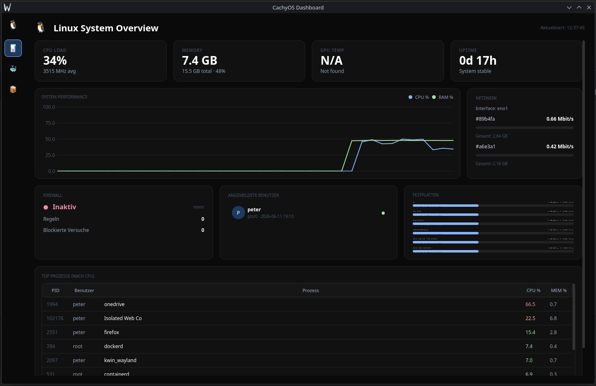
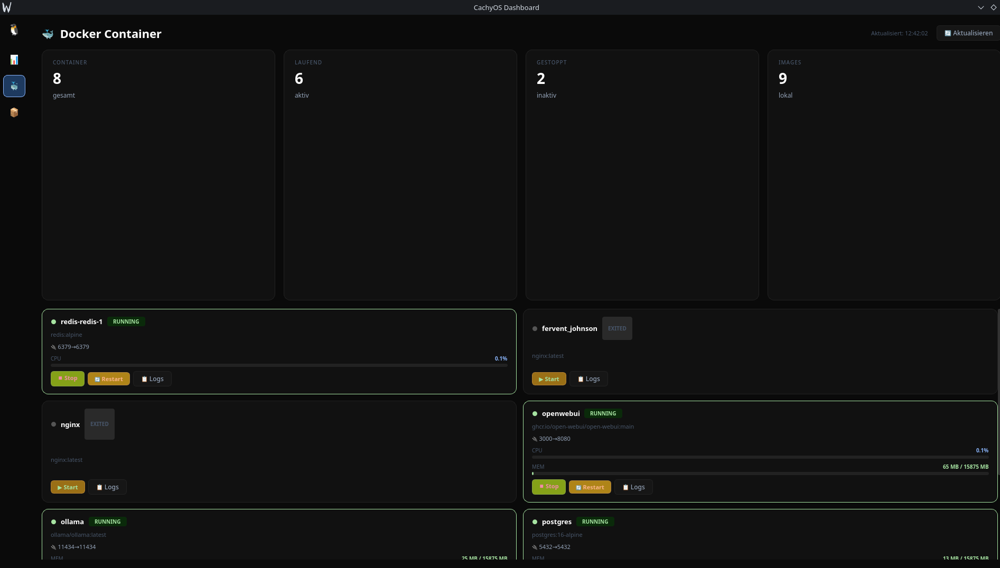
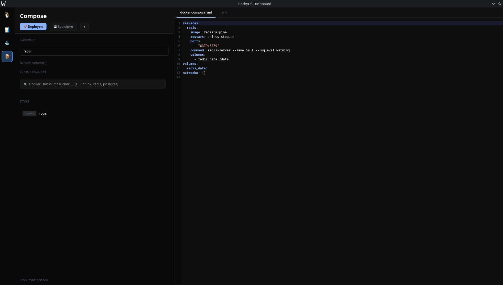

# CachyOS Dashboard

> Linux DevOps Dashboard — System Monitoring, Docker Management und Compose Editor in einer Qt-App.

Kein Portainer-Abo, kein Web-Interface-Overhead. Ein natives Desktop-Dashboard das alles zeigt was ein Linux-Entwickler täglich braucht.

---

## Screenshots

### System Overview


### Docker Container Management


### Docker Compose Editor


---

## Features

### 🖥️ System Overview
- CPU Load, RAM, GPU Temp, Uptime — live
- System Performance Graph (CPU % / RAM %)
- Netzwerk-Interfaces mit Durchsatz
- Firewall-Status und Regeln
- Angemeldete Benutzer
- Festplatten-Auslastung
- Top Prozesse nach CPU/MEM

### 🐳 Docker Management
- Container-Übersicht (laufend / gestoppt / Images)
- Start, Stop, Restart pro Container
- Live CPU/MEM pro Container
- Log-Viewer direkt in der UI
- Docker Hub Suche

### 📝 Docker Compose Editor
- Compose-Stacks verwalten
- docker-compose.yml direkt bearbeiten
- .env Dateien editieren
- Ein-Klick Deploy

---

## Stack

- **Python**
- **Qt** (PyQt/PySide)
- **Docker SDK**
- **psutil** für System-Metriken

---

## Setup

```bash
# Dependencies installieren
pip install -r requirements.txt

# Starten
python main.py
```

---

## Warum?

Portainer ist gut — aber browserbasiert, schwergewichtig und für lokale Entwicklung überdimensioniert. CachyOS Dashboard ist eine native Qt-App die in Sekunden startet und alles auf einen Blick zeigt.

---

## Autor

**Peter Päffgen** — [paeffgen-it.de](https://paeffgen-it.de) · [GitHub](https://github.com/peter1965p)
